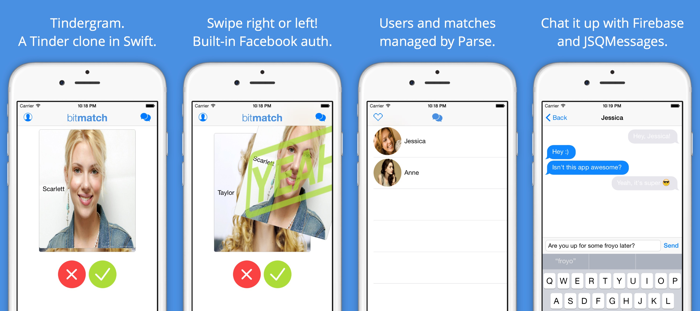

# Tindergram
Tinder clone in Swift.

#Features
- Facebook authentication
- Parse backend (for storing user information)
- Send and receive messages with Firebase

## How to try this out
You have two options:

1. Tweet ([@thomasmeagher](https://twitter.com/thomasmeagher)) or email (tom@meagher.co) and I will give you access to my Parse DB, which contains test users
2. Create your own Parse, Facebook, and Firebase app

The first option is easier, but once you swipe through all my test users, you'll have to wait for me to reset them. Below, I walk you through option two. If you still need help: @thomasmeagher or tom@meagher.co.

## Initial Set up
1. Clone the repo
2. Open Tindergram.xcworkspace (important)

## Setting up Parse
1. Sign up or login to [Parse](https://parse.com)
2. Create a new app
3. Add a new class of type, User
4. Go to Constants.swift and insert your parseAppID and parseClientKey

## Setting up Facebook
1. Go to [Facebook Developer](https://developers.facebook.com)
2. Add a new app
3. Configure your info.plist and bundle identifier (the quickstart guide walks through this process)

## Setting up Firebase
1. Sign up or login to [Firebase](https://firebase.com)
2. Create a new app
3. Go to Constants.swift and insert your firebaseAppURL

## Wrapping Up
1. Run the app and login
2. Check Parse. If everything worked correctly, you should now appear as a user.
3. You will want to add test users in Parse so that you have people to swipe through
4. Enjoy

## License
Tindergram is released under the MIT license. See LICENSE for details.

*Credit to Bitfountain for their [awesome iOS 8 Course](http://bitfountain.io/courses/complete-ios8) and app assets*